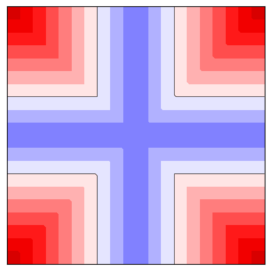
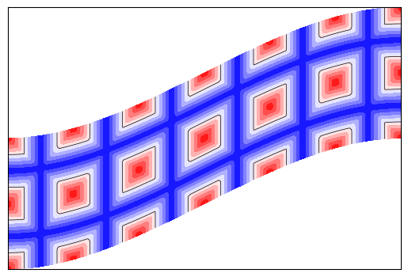
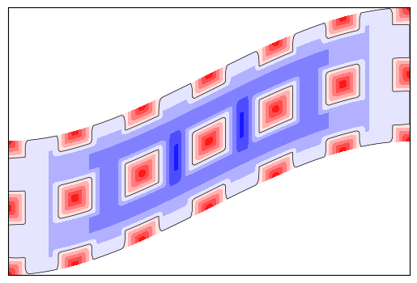
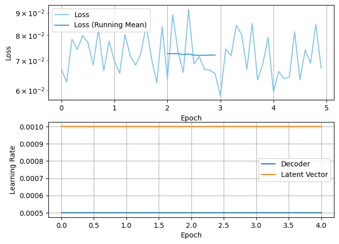

# DeepSDFStruct

A differentiable framework for generating and deforming 3D microstructured materials using Signed Distance Functions (SDFs) and spline-based lattices.
## Coverage
[](https://github.com/mkofler96/DeepSDFStruct/actions/workflows/test.yml)
[](https://coveralls.io/github/mkofler96/DeepSDFStruct?branch=main)
## 📦 Installation

You can install `DeepSDFStruct` directly from GitHub using `pip`:

```bash
pip install git+https://github.com/mkofler96/DeepSDFStruct.git
```
To add it to your uv project run:
```
uv add git+https://github.com/mkofler96/DeepSDFStruct.git
```

### ⚠️ Troubleshooting

If you encounter issues during installation, contact Michael Kofler.

---

## 🚀 Quick Start
This section shows how to use the main features of this library. Further details can be found in [example.ipynb](example.ipynb).

Here's a simple example using a pretrained DeepSDF model, lattice structure generation, and deformation:

```python
from DeepSDFStruct.pretrained_models import get_model, PretrainedModels
from DeepSDFStruct.SDF import SDFfromDeepSDF
from DeepSDFStruct.lattice_structure import LatticeSDFStruct
from DeepSDFStruct.parametrization import Constant
from DeepSDFStruct.torch_spline import TorchSpline
import splinepy
import torch
```

### Load a pretrained DeepSDF model

```python
model = get_model(PretrainedModels.AnalyticRoundCross)
sdf = SDFfromDeepSDF(model)
```

### Set the latent vector and visualize a slice of the SDF

```python
sdf.set_latent_vec(torch.tensor([0.3]))
_ = sdf.plot_slice(origin=(0, 0, 0))
```



### Define a spline-based deformation field

```python
import numpy as np

height = 1.0
surface_cps = np.array(
	[
		[0.0, 0.0, 0.0],
		[1.0, 0.0, 0.0],
		[2.0, 1.0, 0.0],
		[3.0, 1.0, 0.0],
		[0.0, 0.0 + height, 0.0],
		[1.0, 0.0 + height, 0.0],
		[2.0, 1.0 + height, 0.0],
		[3.0, 1.0 + height, 0.0],
		[0.0, 0.0, 1.0],
		[1.0, 0.0, 1.0],
		[2.0, 1.0, 1.0],
		[3.0, 1.0, 1.0],
		[0.0, 0.0 + height, 1.0],
		[1.0, 0.0 + height, 1.0],
		[2.0, 1.0 + height, 1.0],
		[3.0, 1.0 + height, 1.0],
	]
)
spline = splinepy.Bezier(degrees=[3, 1, 1], control_points=surface_cps).bspline
deformation_spline = TorchSpline(spline)
```

### Create the lattice structure with deformation and microtile

```python
lattice_struct = LatticeSDFStruct(
	tiling=(6, 2, 1),
	microtile=sdf,
	parametrization=Constant([0.5], device=model.device),
)
```

### Visualize a slice of the final lattice structure

```python
_ = lattice_struct.plot_slice(origin=(0, 0, 0.5), deformation_function=deformation_spline)
```



Since all SDFs are callable, the signed distance can be obtained by calling e.g.

```python
lattice_struct(torch.tensor([[0, 0, 0], [0, 1, 0]], dtype=torch.float32))
```

The `CappedBorderSDF` class helps to avoid non-watertight meshs, by capping the borders.

```python
from DeepSDFStruct.SDF import CappedBorderSDF
capped_lattice = CappedBorderSDF(lattice_struct)
_ = capped_lattice.plot_slice(origin=(0, 0, 0.5), deformation_function=deformation_spline)
```



Furthermore, a differentiable surface mesh can be extracted and exporte

```python
from DeepSDFStruct.mesh import create_3D_mesh, export_surface_mesh

surf_mesh, derivative = create_3D_mesh(
	capped_lattice, 30, differentiate=True, mesh_type="surface"
)
export_surface_mesh(
	"mesh_with_derivative.vtk",surf_mesh, derivative
)
```

The libraries gustaf and meshio can be used to export the mesh to differnt formats.

```python
import gustaf as gus
faces = surf_mesh.to_gus()
gus.io.meshio.export("faces.inp", faces)
gus.io.meshio.export("faces.obj", faces)
```

Finally, there is also a functionality to create a volumetric mesh from the generated surface mesh.

```python
from DeepSDFStruct.mesh import tetrahedralize_surface
volumes, _ = tetrahedralize_surface(faces)
gus.io.mfem.export("volumes.mfem", volumes)
```

### Training a Model
A model can be trained by using the `train_deep_sdf` function that takes as input the experiment directory and the data directory.`train_deep_sdf("DeepSDFStruct/trained_models/test_experiment", data_dir)`

```python
from DeepSDFStruct.deep_sdf.training import train_deep_sdf
```

Example data can be downloaded from huggingface

```python
from huggingface_hub import snapshot_download
data_dir = snapshot_download(
	"mkofler/lattice_structure_unit_cells", repo_type="dataset"
)
train_deep_sdf("DeepSDFStruct/trained_models/test_experiment", data_dir)
```



Note that this data contains the preprocessed and sampled data.
The data that is used for training a DeepSDF model needs to be in the form of `.npz` files that contain the negative and positive points as an [x,y,z] array.
This can be achieved by using numpy's export function:
```python
np.savez(file_name, neg=neg_points, pos=pos_points)
```

### Generation of Training Data
Different types of geometry representations can be used for training. One possibility is to use the python library splinepy:

```python
import splinepy
import numpy as np
from DeepSDFStruct.sampling import SDFSampler
from DeepSDFStruct.splinepy_unitcells.chi_3D import Chi3D
from DeepSDFStruct.splinepy_unitcells.cross_lattice import CrossLattice

outdir = "./training_data"
splitdir = "./training_data/splits"
dataset_name = "example_dataset"

sdf_sampler = SDFSampler(outdir, splitdir, dataset_name)

t_start = 0.1 * np.sqrt(2) / 2
t_end = 0.15 * np.sqrt(2) / 2
crosslattice_tiles = []
for t in np.linspace(t_start, t_end, 3):
	tile, _ = CrossLattice().create_tile(np.array([[t]]), make3D=True)
	crosslattice_tiles.append(splinepy.Multipatch(tile))

chi = Chi3D()
chi_tiles = []

for phi in np.linspace(0, -np.pi / 6, 2):
	for x2 in np.linspace(-0.1, 0.2, 2):
		t = 0.1
		x1 = 0.2
		r = 0.5 * t
		tile, _ = chi.create_tile(np.array([[phi, t, x1, x2, r]] * 5))
		chi_tiles.append(splinepy.Multipatch(tile))

sdf_sampler.add_class(chi_tiles, class_name="Chi3D_center")
sdf_sampler.add_class(crosslattice_tiles, class_name="CrossLattice")

sdf_sampler.process_geometries(
	sampling_strategy="uniform", n_faces=100
)

sdf_sampler.write_json("chi_and_cross.json")
```

For the full documentation, visit [mkofler96.github.io/DeepSDFStruct/](https://mkofler96.github.io/DeepSDFStruct/).
## 🔗 Repository

GitHub: [https://github.com/mkofler96/DeepSDFStruct](https://github.com/mkofler96/DeepSDFStruct)

---

## 📄 License
This project is licensed under the **Apache License 2.0**.  
See the [LICENSE](./LICENSE) file or visit [http://www.apache.org/licenses/LICENSE-2.0](http://www.apache.org/licenses/LICENSE-2.0) for more information.
